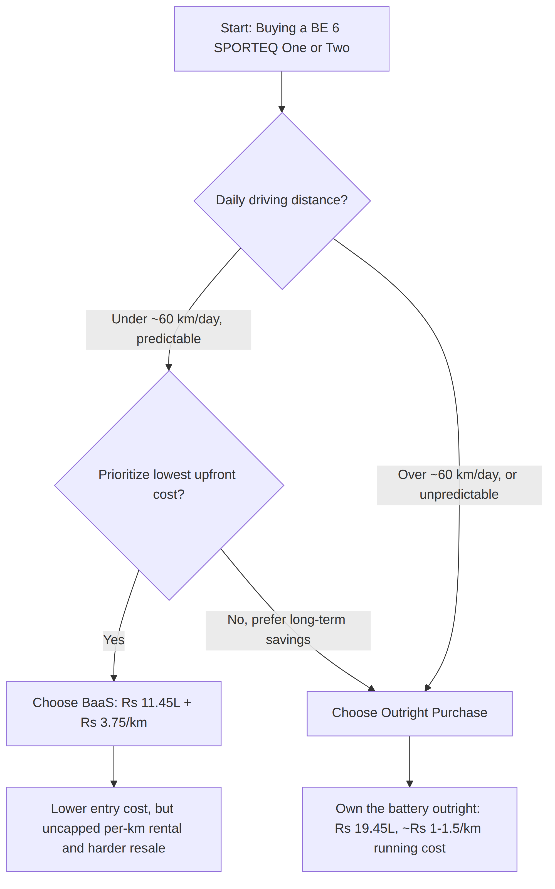
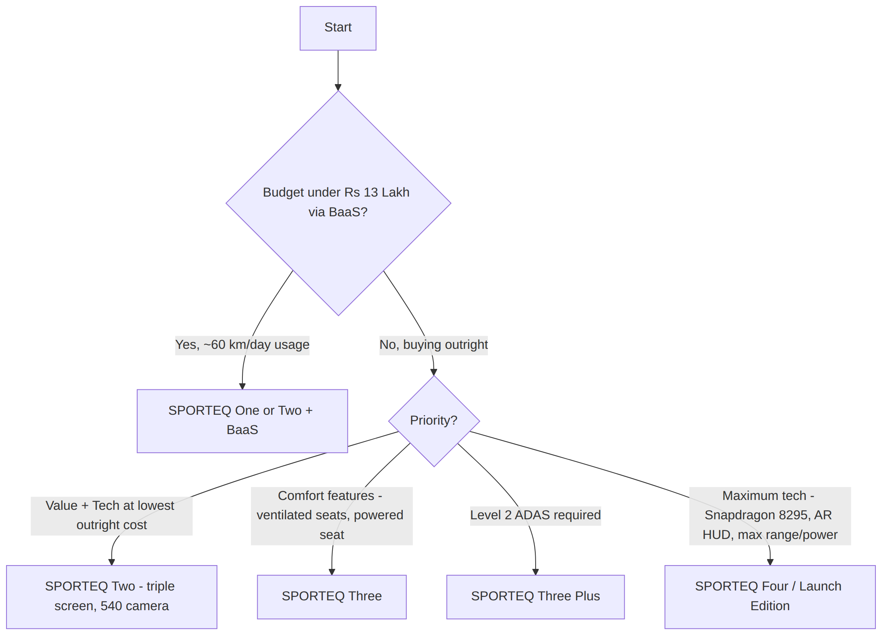

# Mahindra BE 6 (2026) SPORTEQ

## In-Depth Buyer's Research Report

**Confidential — Personal Research Compilation**
**Version:** 1.0
**Date:** September 5, 2026
**Market:** India (Ex-Showroom Pricing)
**Scope:** SPORTEQ One -> SPORTEQ Four / Launch Edition, BaaS Program, Warranty, Ownership Economics

---

## Table of Contents

1. [Executive Summary](#1-executive-summary)
2. [Powertrain, Battery & Efficiency](#2-powertrain-battery--efficiency)
3. [Cost Analysis: BaaS vs. Outright Purchase](#3-cost-analysis-baas-vs-outright-purchase)
4. [Warranty Details](#4-warranty-details)
5. [Variant-Wise Pricing & Feature Matrix](#5-variant-wise-pricing--feature-matrix)
6. [Additional Highlights](#6-additional-highlights)
7. [Charging on Long-Distance Journeys](#7-charging-on-long-distance-journeys)
8. [Pros & Cons Analysis](#8-pros--cons-analysis)
9. [Comparison vs. Key Rivals](#9-comparison-vs-key-rivals)
10. [Which Variant Should You Buy?](#10-which-variant-should-you-buy)
11. [Buyer's Due-Diligence Checklist](#11-buyers-due-diligence-checklist)
12. [Appendix A: Glossary of Terms](#appendix-a-glossary-of-terms)
13. [Appendix B: Sources & Methodology](#appendix-b-sources--methodology)

---

## 1. Executive Summary

The **Mahindra BE 6** (originally unveiled as the BE 6e) is a coupe-style electric SUV built on Mahindra's dedicated born-electric **INGLO** platform. In August 2026, Mahindra relaunched the lineup as the **BE 6 SPORTEQ**, restructuring the trims (One -> Four), adding a new **70 kWh** mid-tier battery, a triple 12.3-inch "coast-to-coast" cockpit, and — most disruptively — a **Battery-as-a-Service (BaaS)** ownership model that cuts the entry price to **₹11.45 Lakh**.

### 1.1 Top Value Propositions

| # | Value Proposition | Supporting Metric |
|---|---|---|
| 1 | Longest range in its price segment | Up to **682 km** ARAI (79 kWh pack) |
| 2 | Lowest possible entry price via BaaS | **₹11.45 Lakh** ex-showroom (vs ₹19.45L outright) — a **41% cut** in upfront cost |
| 3 | Strongest performance in segment | **286 PS**, 0-100 km/h in **6.7 seconds** (top pack) |
| 4 | Fastest charging in segment | 20% -> 80% in **20 minutes** on a 140-180 kW DC charger |
| 5 | Best-in-class battery assurance | **Lifetime warranty**, unlimited km, for the first registered owner |

### 1.2 Quick Facts

| Attribute | Detail |
|---|---|
| Body Style | Coupe-style Electric SUV |
| Platform | Mahindra INGLO (born-electric) |
| Battery Options | 59 kWh / 70 kWh / 79 kWh |
| Price Range (Outright) | ₹19.45 Lakh – ₹26.95 Lakh (ex-showroom) |
| Price Range (with BaaS) | ₹11.45 Lakh – ₹12.95 Lakh (One & Two only) |
| Variants | SPORTEQ One, Two, Three, Three+, Four/Launch Edition, Formula E Edition |
| Segment Rivals | Tata Curvv EV, Hyundai Creta Electric |

### 1.3 Who Should Consider the BE 6 SPORTEQ

* Buyers who want the **longest range and most power** in the mid-size electric SUV segment.
* Low, predictable daily commuters (~60 km/day) who want to **minimize upfront cost** via BaaS.
* Tech-forward buyers who value a large digital cockpit, AI voice assistant, and ADAS on higher trims.
* Buyers comfortable with a **relatively new platform** (2025-26) with a shorter reliability/resale track record than legacy ICE-to-EV conversions from established players.

---

## 2. Powertrain, Battery & Efficiency

The BE 6 features a rear-mounted, 3-in-1 integrated electric motor setup with performance scaling across three battery configurations.

| Battery Pack | Motor Power | Torque | ARAI Range | Est. Real-World Range | Efficiency (ARAI) |
| :--- | :--- | :--- | :--- | :--- | :--- |
| **59 kWh** | 228 bhp (170 kW) | 380 Nm | 548 km | 400 – 450 km | ~9.28 km/kWh |
| **70 kWh** | 245 PS (180 kW) | 380 Nm | 651 km | 480 – 525 km | ~9.30 km/kWh |
| **79 kWh** | 286 bhp (210 kW) | 380 Nm | 682 km | 500 – 550 km | ~8.63 km/kWh |

> **Note:** Torque is identical (380 Nm) across all three packs — the power difference comes from motor tuning and available battery voltage, not a different physical motor.

### 2.1 Key Performance Metrics

* **0-100 km/h:** 6.7 seconds (79 kWh, 286 bhp variants only — lower packs are not officially rated for this benchmark).
* **DC Fast Charging:** 140–180 kW, enabling a 20% -> 80% charge in **20 minutes**.
* **AC Home Charging:** 7.2 kW / 11.2 kW wallbox — roughly **6 to 11.5 hours** depending on battery size.
* **Portable Cable:** 3 kW, 3-pin socket compatible (see [Section 7](#7-charging-on-long-distance-journeys)).

---

## 3. Cost Analysis: BaaS vs. Outright Purchase

Mahindra introduced the **Battery-as-a-Service (BaaS)** model to significantly lower the upfront cost of the vehicle. Under this scheme, the buyer pays only for the car shell and rents the battery on a per-kilometer usage basis.

### 3.1 BaaS (Battery-as-a-Service) Program

| Attribute | Detail |
|---|---|
| Availability | SPORTEQ One & Two only, 59 kWh battery |
| Upfront Vehicle Cost (SPORTEQ One) | ₹11.45 Lakh (ex-showroom) |
| Battery Rental Rate | ₹3.75 per km (**uncapped**) |
| Minimum Monthly Payment | ~₹6,750/month, assuming 60 km/day over an 8-year battery loan |
| Best Fit | Predictable daily runners at ~60 km/day who prioritize low upfront cost |
| Trade-off | Cheaper to buy by ~₹8 Lakh, but the buyer never owns the battery, which complicates resale |

### 3.2 Outright Purchase (Without BaaS)

| Attribute | Detail |
|---|---|
| Upfront Vehicle Cost (SPORTEQ One) | ₹19.45 Lakh (ex-showroom) |
| Battery Ownership | Full ownership of the 59 kWh battery included in price |
| Running Cost | ₹1 – ₹1.5 per km on home AC electricity — no per-km rental |

### 3.3 BaaS vs. Outright — Decision Flow

> **Diagram:** A decision flow showing that BaaS suits low-mileage, cost-sensitive buyers, while high-mileage or long-term owners are better served by an outright purchase because the per-km rental has no cap and battery ownership simplifies resale.

---

## 4. Warranty Details

Mahindra offers an industry-leading warranty on the high-voltage battery to reassure early adopters of the INGLO platform.

| Coverage | Terms |
|---|---|
| **First Registered Owner** | Lifetime warranty, **unlimited kilometers** |
| **Subsequent Owners (Resale)** | Transfers, but capped at **10 years or 2,00,000 km**, whichever comes first, from date of first registration |
| **Standard Vehicle Warranty** | **3 years**, unlimited mileage (separate from the battery warranty) |
| **Extended Cover** | Mahindra's **SHIELD** extended warranty is available as a paid add-on at purchase |

> **Buyer Note:** The lifetime battery warranty is generous, but general vehicle defects and electronics are only covered for 3 years unless SHIELD is purchased separately. Some early SPORTEQ owner reviews report post-warranty-window niggles, making SHIELD worth evaluating at the time of booking.

---

## 5. Variant-Wise Pricing & Feature Matrix

### 5.1 Pricing Summary (Ex-Showroom)

| Variant | Battery Size | Price without BaaS | Price with BaaS |
| :--- | :--- | :--- | :--- |
| **SPORTEQ One** | 59 kWh | ₹19.45 Lakh | ₹11.45 Lakh |
| **SPORTEQ Two** | 59 kWh | ₹20.95 Lakh | ~₹12.95 Lakh |
| **SPORTEQ Three** | 59 kWh | ₹21.95 Lakh | N/A |
| **SPORTEQ Three** | 70 kWh | ₹22.95 Lakh | N/A |
| **SPORTEQ Three Plus** | 70 kWh | ₹23.95 Lakh | N/A |
| **SPORTEQ Three Plus** | 79 kWh | ₹24.95 Lakh | N/A |
| **Formula E Edition** | 79 kWh | ₹24.45 Lakh | N/A |
| **SPORTEQ Four / Launch Edition** | 79 kWh | ₹26.95 Lakh | N/A |

### 5.2 Feature-by-Feature Breakdown

| Feature / Spec | SPORTEQ One | SPORTEQ Two | SPORTEQ Three | SPORTEQ Three+ | SPORTEQ Four (Flagship) |
| :--- | :--- | :--- | :--- | :--- | :--- |
| Battery Options | 59 kWh | 59 kWh | 59 kWh, 70 kWh | 70 kWh, 79 kWh | 79 kWh |
| Power Output | 228 bhp | 228 bhp | 228 bhp (59) / 245 PS (70) | 245 PS (70) / 286 bhp (79) | 286 bhp |
| ARAI Range | 548 km | 548 km | 548 – 651 km | 651 – 682 km | 682 km |
| BaaS Eligibility | Yes, from Rs 11.45L | Yes, from ~Rs 12.95L | No | No | No |
| Display / Cockpit | Dual 12.3" screens | Triple-screen (coast-to-coast) | Triple-screen | Triple-screen | Triple-screen |
| Processing Power | Standard | Standard | Standard | Standard | **Snapdragon 8295** |
| Camera & Parking | Reverse camera | 540° camera + front sensors | 540° camera + front sensors | 540° camera + front sensors | 540° camera + front sensors |
| Safety / TPMS | 6 airbags, ESP, EPB | + Individual TPMS | Individual TPMS | Individual TPMS | Individual TPMS |
| Driver Assistance | Basic cruise control | Basic cruise control | Basic cruise control | **Level 2 ADAS** + auto regen | Level 2 ADAS + auto regen |
| Seating & Comfort | Manual seats | Manual seats | 6-way power driver seat w/ memory | 6-way power driver seat w/ memory | 6-way power driver seat w/ memory |
| Climate Control | Standard AC | Standard AC | Ventilated front seats | Ventilated front seats | Ventilated front seats |
| Special Tech | Drive modes, Drift mode | Manual drive video recording | Manual drive video recording | Manual drive video recording | **Augmented Reality HUD** |

### 5.3 Key Takeaways

1. **The Sweet Spot:** SPORTEQ Two is the best value for tech-focused buyers on a budget — it adds the triple-screen dashboard and 540° camera while remaining BaaS-eligible.
2. **The Comfort Pick:** SPORTEQ Three is the first trim with ventilated seats and a powered driver's seat.
3. **The Tech Flagship:** Level 2 ADAS requires stepping up to Three+; only the Four has the Snapdragon 8295 chip and AR HUD.

---

## 6. Additional Highlights

| Attribute | Value |
|---|---|
| Dimensions (L x W x H) | 4,371 mm x 1,907 mm x 1,627 mm |
| Wheelbase | 2,775 mm |
| Boot Space | 455 litres |
| Cockpit | "Coast-to-coast" three-screen digital cockpit (from SPORTEQ Two) |
| AI Assistant | TEQ_Talk, powered by Google Gemini (part of the "TEQ Suites") |
| Suspension | Semi-active (Frequency Selective Damping) and drive modes on higher trims |

---

## 7. Charging on Long-Distance Journeys

A common buyer question: *"Can I carry a charger for a road trip?"* The honest answer is **partially**.

* **Portable AC cable (carriable):** BE 6 ships with a 3 kW portable charging cable for any standard 3-pin 15A socket. It fits in the boot but only adds **~25–30 km of range per hour** — suitable for an overnight top-up, not a mid-journey stop.
* **DC fast charger (not carriable):** The 140-180 kW units that deliver the 20-minute top-up are large stationary installations requiring a 3-phase high-voltage grid connection and active cooling. There is no portable equivalent.
* **No practical "power bank" option:** A portable pack large enough to meaningfully extend a 59-79 kWh battery would be nearly as big, heavy, and expensive as the car's own battery — no such consumer product exists.
* **Recommended approach:** Plan routes around fixed DC fast-charging stations (Mahindra's own network, Statiq, Tata Power EZ Charge, Zeon, ChargeZone) and treat the portable cable as a backup only. India's highway fast-charging network is expanding but still patchy in 2026.
* **Emerging safety net:** On-demand mobile EV charging vans (e.g. Tata.ev + Hopcharge in the NCR) are appearing in some metro regions for roadside emergencies, but this is not yet nationwide.

---

## 8. Pros & Cons Analysis

| Category | Pros | Cons |
|---|---|---|
| **Range & Battery** | Longest ARAI range in segment (548–683 km); lifetime battery warranty for first owner | Real-world highway/high-speed range drops noticeably below ARAI figures per independent owner reviews |
| **Performance** | Most powerful motor in segment (up to 286 PS); 0-100 in 6.7s on top variant; strong low-end torque (380 Nm across all packs) | Firm suspension tuned for handling gives a stiffer ride than rivals like Creta Electric or Curvv EV |
| **Pricing & BaaS** | BaaS cuts upfront cost by ~₹8 Lakh for predictable low-mileage buyers | Uncapped ₹3.75/km rental + ~₹6,750/month minimum tied to an 8-year loan; costs more over time for high-mileage owners, and complicates resale |
| **Warranty** | Lifetime, unlimited-km battery warranty for first owner; 10yr/2,00,000km on resale | Standard vehicle warranty is only 3 years; SHIELD extended cover is a separate paid add-on |
| **Interior & Tech** | Triple 12.3" screen cockpit, Gemini-based TEQ_Talk assistant, semi-active suspension on top trims | Coupe-SUV roofline compresses rear headroom/legroom; some reviews describe rear seats as cramped |
| **Cabin Comfort** | Panoramic moonroof; wireless CarPlay/Android Auto now standard after an OTA update | Auto AC mode reportedly skips lower-body airflow; panoramic glass roof can heat the cabin faster in Indian summers |
| **Charging** | Fast DC charging (140-180 kW, 20 min for 20->80%); flexible AC home charging (7.2/11.2 kW) | Ex-showroom price excludes home wallbox + installation (~₹50,000-75,000); 180 kW charging network still thin outside major routes |
| **Ownership Experience** | Strong delivery ramp post-launch; broad variant/battery choice for different budgets | Waiting periods have historically ranged 2–10 months depending on variant, colour, and city |
| **Value vs. Rivals** | Beats Curvv EV and Creta Electric on outright range and power | Costs more than both at comparable trims; platform is new (2025-26) with limited reliability/resale history |

---

## 9. Comparison vs. Key Rivals

| Metric | Mahindra BE 6 SPORTEQ (base) | Tata Curvv EV | Hyundai Creta Electric |
|---|---|---|---|
| Starting Price (ex-showroom) | ₹19.45 Lakh | ₹17.49 Lakh | ₹18.02 Lakh |
| Entry Battery | 59 kWh | 55 kWh | 42 kWh |
| Entry Motor Power | 228 bhp | 165 bhp | Varies by pack |
| Entry Torque | 380 Nm | 215 Nm | — |
| Entry ARAI Range | 548 km | 502 km | 390 km (42 kWh) / 473 km (51.4 kWh) |
| 0-100 km/h | 6.7s (top 79 kWh pack) | 8.5s | 7.9s (Long Range variant) |
| Max Range (any pack) | 682 km | 502 km | 473 km |

> **Takeaway:** The BE 6 SPORTEQ leads on outright range and power at every price point, but it also starts higher than both direct rivals. Buyers prioritizing price should cross-shop the Curvv EV and Creta Electric before committing to the BE 6's premium.

---

## 10. Which Variant Should You Buy?

> **Diagram:** A decision flow guiding buyers from budget and priority (cost, comfort, ADAS, or flagship tech) to the recommended SPORTEQ trim.

---

## 11. Buyer's Due-Diligence Checklist

Before signing the booking form, verify the following:

1. **Real-world range expectations** — do not plan trips purely around the ARAI figure; independent reviews report meaningfully lower range at sustained highway speeds.
2. **Rear-seat comfort** — sit in the back seat yourself if you'll regularly carry adult passengers; the coupe roofline compresses headroom/legroom.
3. **BaaS math for your actual usage** — model your real daily/monthly km against the ₹3.75/km rental before assuming BaaS is cheaper long-term.
4. **Extended warranty** — evaluate Mahindra's SHIELD plan at booking time; the standard vehicle warranty is only 3 years.
5. **Hidden costs** — budget an additional ₹50,000–75,000 for a home wallbox charger and installation, on top of the ex-showroom price.
6. **Current waiting period** — confirm with your dealer; historically 2–10 months depending on variant, colour, and city.
7. **Software update status** — if buying a used/early unit, confirm the wireless CarPlay/Android Auto OTA update has been applied.
8. **Charging infrastructure on your regular routes** — check DC fast-charging coverage (via the car's app or Mahindra's network map) for your typical long-distance drives before relying on it.
9. **State EV subsidy eligibility** — incentive structures and price caps vary by state (Delhi, Maharashtra, Gujarat, etc.); confirm current eligibility for your chosen variant's price before assuming a subsidy applies.

---

## Appendix A: Glossary of Terms

| Term | Definition |
|---|---|
| **ARAI** | Automotive Research Association of India — the body issuing official certified range/efficiency figures |
| **BaaS** | Battery-as-a-Service — an ownership model where the battery is rented separately from the vehicle |
| **INGLO** | Mahindra's dedicated "born-electric" vehicle platform underpinning the BE 6 and XEV 9e |
| **kWh** | Kilowatt-hour — unit of battery energy capacity |
| **PS / bhp** | Power units; 1 PS is approximately 0.9863 bhp — near-identical but not exactly interchangeable |
| **DC Fast Charging** | High-power charging (kW) delivered as direct current, used for rapid top-ups at public stations |
| **ADAS** | Advanced Driver Assistance Systems (e.g. Level 2: lane-keep assist, adaptive cruise control) |
| **TPMS** | Tyre Pressure Monitoring System |
| **SHIELD** | Mahindra's paid extended warranty program |

---

## Appendix B: Sources & Methodology

This report compiles data from the project's research files (`mahindra_be6_research.md`, `mahindra_be6_pricing.csv`, `mahindra_be6_pros_cons.csv`, `SPORTEQ_Variants_2026.md`), cross-verified against public automotive press coverage (Autocar India, CarDekho, Wikipedia, Team-BHP, ZigWheels, CarWale, and Mahindra's own press releases) as of September 2026.

Two figures were corrected during research verification:
* Vehicle height: corrected from 1,635 mm to the verified **1,627 mm**.
* 70 kWh variant specs: corrected from 228 bhp / ~600 km to the verified **245 PS / 651 km ARAI**.

**Disclaimer:** Prices, specifications, and features are subject to change by Mahindra without notice. Always confirm current figures with an authorized dealer before making a purchase decision.

---

## Document Certification & Signature

---

**Developed and Maintained by**

# Lalatenduswain

---

*This document has been compiled from research files and public sources for personal reference.*

| Role | Name | Signature | Date |
|------|------|-----------|------|
| Researcher & Compiler | **Lalatenduswain** | _________________________ | September 5, 2026 |

---

> *"Research thoroughly, buy confidently."*
>
> — **Lalatenduswain**

---

**Repository:** [github.com/Lalatenduswain/mahindra-be6](https://github.com/Lalatenduswain/mahindra-be6)
**Version Control:** All changes tracked in Git — see commit history

---

*This document is a personal research compilation and is not affiliated with or endorsed by Mahindra & Mahindra Ltd.
Prices and specifications may have changed since publication — verify with an authorized dealer.*

**© 2026 Lalatenduswain. All rights reserved.**

<!--
=============================================================
PDF EXPORT INSTRUCTIONS
=============================================================

Option 1 — Pandoc (Recommended for professional output):
  pandoc Mahindra_BE6_Research_Report.md -o Mahindra_BE6_Research_Report.pdf \
    --pdf-engine=xelatex \
    -V geometry:margin=1in \
    -V fontsize=11pt \
    -V mainfont="Inter" \
    -V colorlinks=true \
    -V linkcolor="007BFF" \
    --toc \
    --toc-depth=3 \
    --highlight-style=tango

Option 2 — Pandoc with custom CSS (for HTML->PDF):
  pandoc Mahindra_BE6_Research_Report.md -o output.html --standalone --css=styles.css
  # Then print to PDF from browser (Ctrl+P -> Save as PDF)

Option 3 — VS Code Extensions:
  - "Markdown PDF" extension by yzane
  - Open file -> Cmd/Ctrl+Shift+P -> "Markdown PDF: Export (pdf)"

Option 4 — Typora:
  - Open file in Typora
  - File -> Export -> PDF

Suggested CSS Variables for --css flag:
  --color-accent: #007BFF
  --color-success: #28A745
  --color-warning: #FFC107
  --font-family: 'Inter', 'Roboto', sans-serif
  --line-height: 1.6
  --page-size: A4

=============================================================
-->
